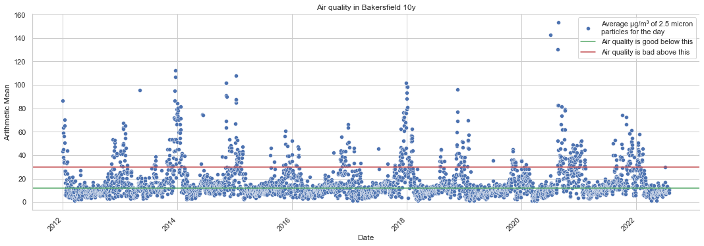

# Air Quality Exploration
After doing the Python Data Science Handbook book review I wanted to try a couple applications of the lessons in the book. The first one was to have a look at air pollution, specifically in Bakersfield, CA. Why there? Because my son is going to go to college there and there was an article that claimed it had the worst air pollution in the U.S. So with that goal in mind, I looked for what was available as far as data to analyze. Due to some act of U.S. Congress with a name I forgot, the data for air quality is pretty great.

Several different things are measured that you can choose from:
* PM 10 is the number of 10 micron particles and goes back to 1989
* PM 2.5 (the measure I used) is 2.5 micron particles and goes back to 1999
* Ozone
* A couple other chemicals
Where is the data collected?
* There can be multiple locations per city
* There are three locations in Bakersfield and two in San Jose

How often are the measurements taken?
* Measurements are taken hourly
* You can also get downloadable sets that are daily averages. This is what I used
What equipment is used?
* You can find a description of the equipment and I could pull up a maintenance guide with descriptions on how to service the system. It looks pretty industrial and seemed much more serious than anything I could get for a reasonable price on Amazon (was thinking to compare measures, but did not)

Other notes
* The data is well maintained and old data gets updated if measures change
* It has easy CSV download files
* There is a lot of easy to find information on what the measures are and how things were collected
* This is really nice data to use as a first try. Kudos to the teams putting this together

Ten Years in Bakersfield
About half of all the days in a year are “not good” and dozens of days each year that are some degree of “bad” (more WordPress readable ones coming)

To see how bad this is we will need some kind of reference. How about some other cities? First, here is Bakersfield for most of 2022

Then have a look at San Jose, CA (large city in California in a valley with occasional, known air quality issues and where I live) and St. Paul, MN (a mid-sized city on a plain that should have pretty good air quality and is about where I grew up) for comparison

This is probably about what we would expect comparing the worst city with a more average one and a good one (if large parts of Canada are not on fire). Speaking of fire, the air was visibly terrible after the Covid outbreak started and there were a series of fires that affected San Jose, CA. Can we spot that?

Yes. Yes we can. So the air quality monitors do seem to work and the data is really nicely packaged to make this sort of thing quite easy

[Working session code for air quality analysis](aq_analysis.py)
